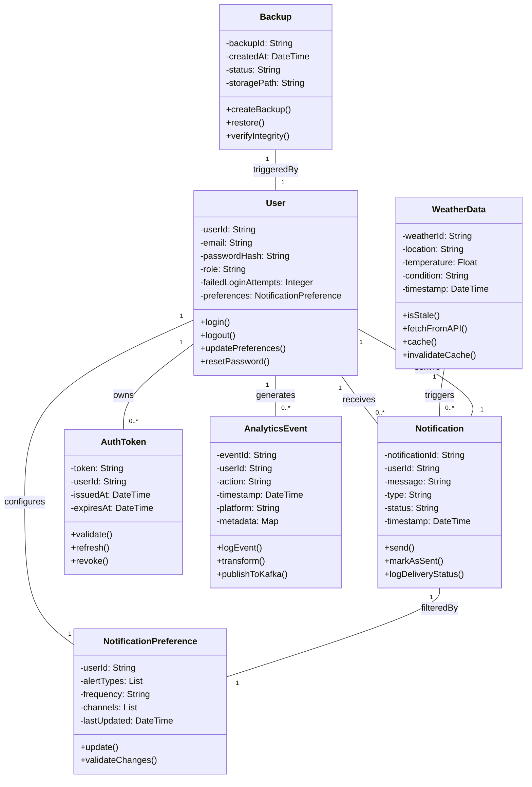

##     Sundry Weather Notifications Class Diagram 

**Design Choices:** 
- Each class includes relevant business logic through methods—for example, Notification.send() supports time-critical delivery, while AnalyticsEvent.publishToKafka() integrates with the app’s real-time tracking pipeline.
- Modularity and separation of concerns by assigning each class a specific responsibility.
  User handles authentication, session control, and preference management.
  NotificationPreference is composed within User, reflecting a tightly bound configuration that should not exist independently.

- Multiplicity captures real-world behavior:
Users can have multiple AuthTokens (for different sessions or devices), and receive many Notifications.
The WeatherData class is designed to trigger alerts for multiple users.

The Security is addressed through the AuthToken validation and role-based access control (RBAC) notes on the User class.
