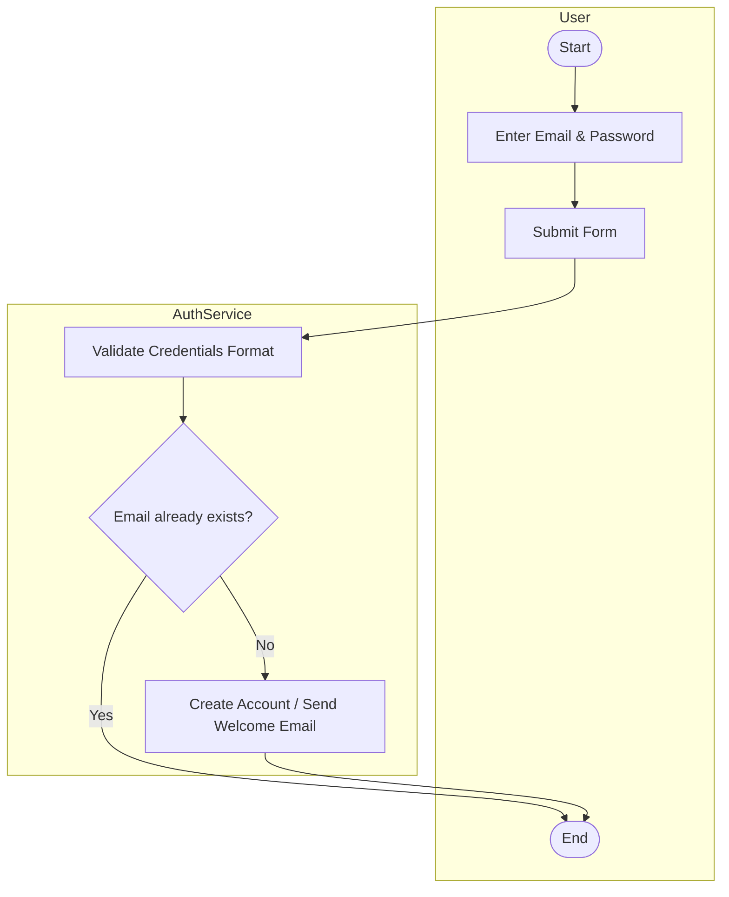
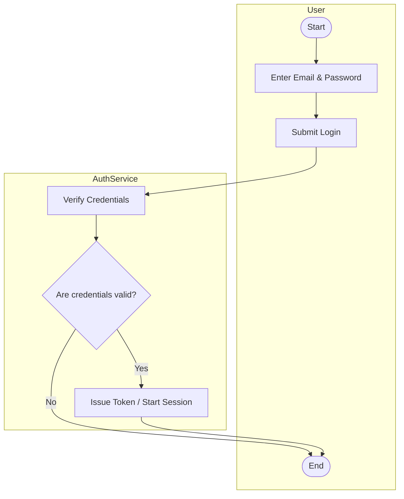
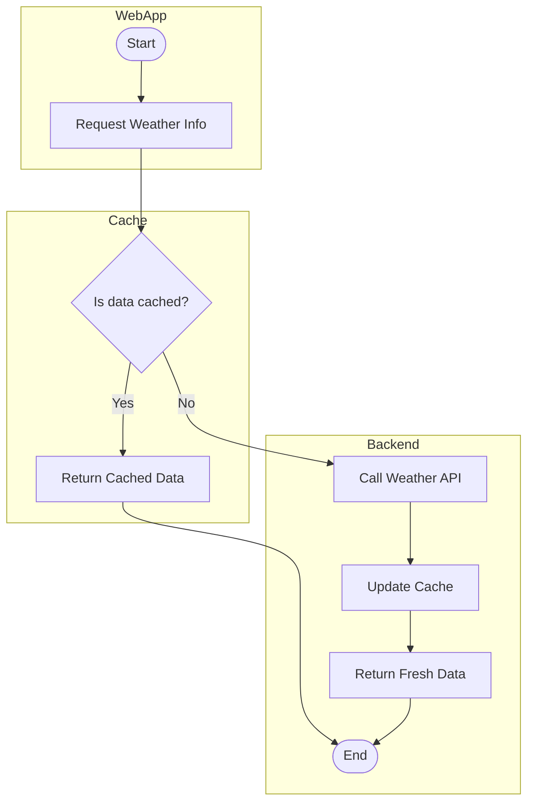
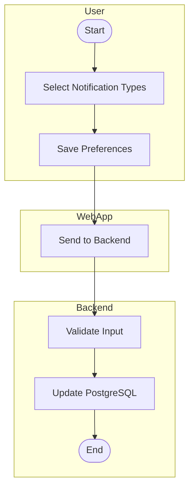
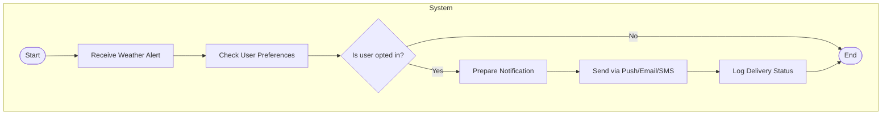
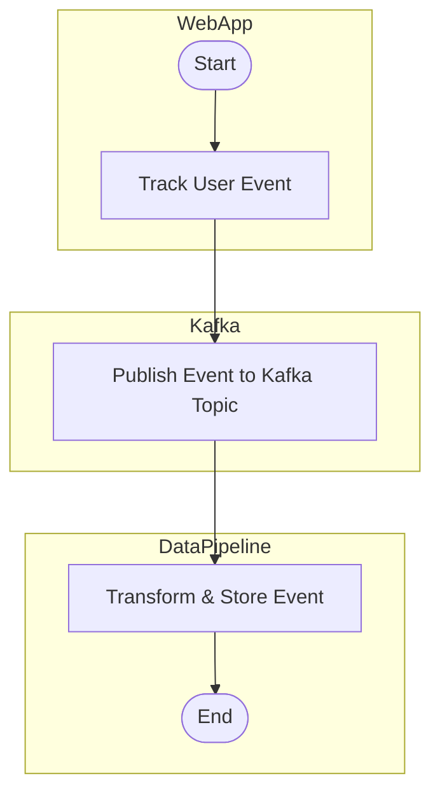
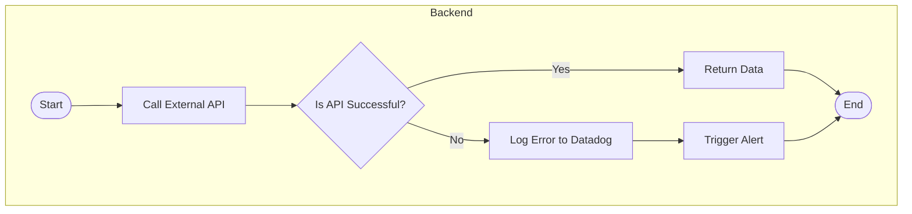
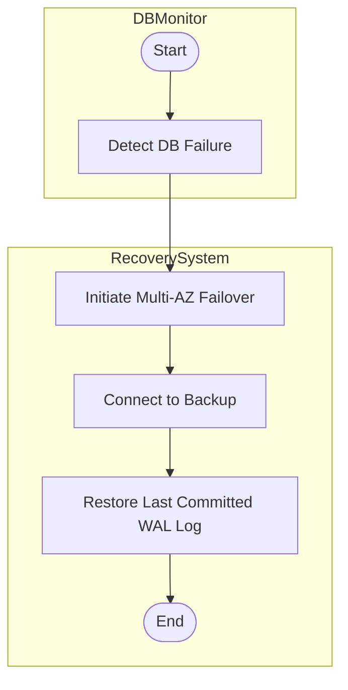

# 🌩️ Sundry Notification App - UML Activity Diagrams

Below are the selected (8) complex workflows represented as UML Activity Diagrams using Mermaid syntax.

---

## 1. User Registration

---

## 2. User Login & Access Token Issuance

---

## 3. Weather Data Request & Caching

---

## 4. Set Notification Preferences

---

## 5. Trigger & Send Push Notification

---

## 6. Log User Activity (Analytics Pipeline)

---

## 7. Handle API Errors & Trigger Alerts

---

## 8. Disaster Recovery: Failover to Backup DB

"""
