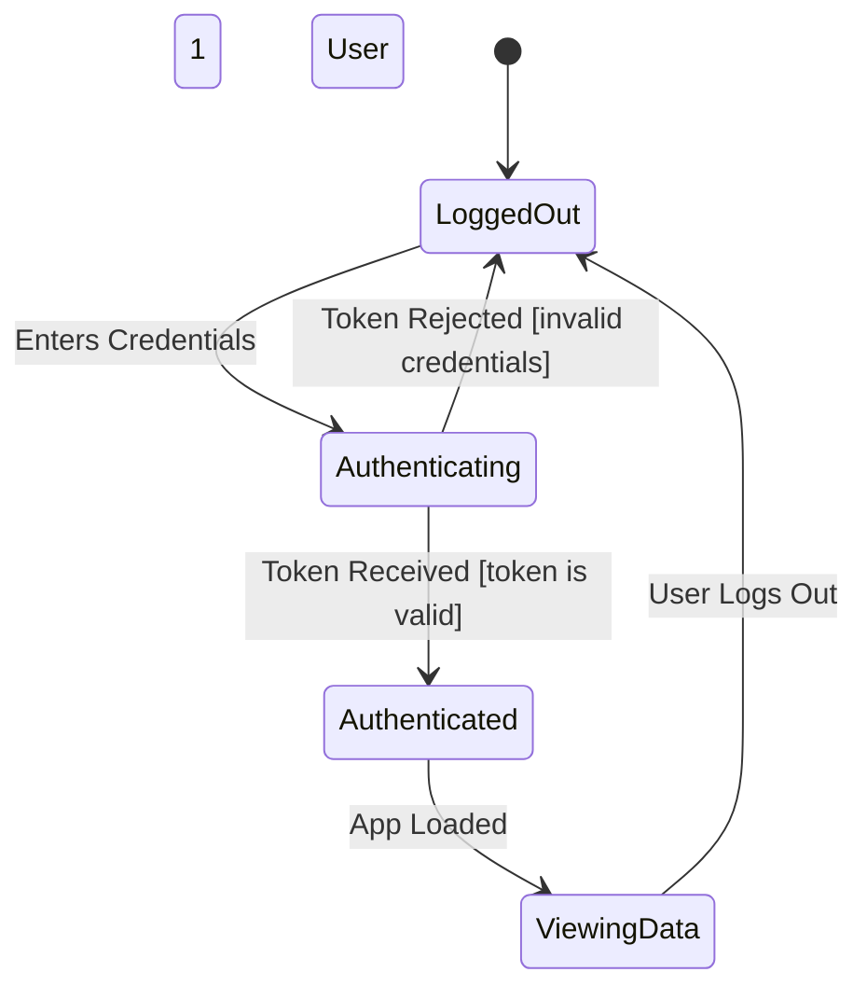
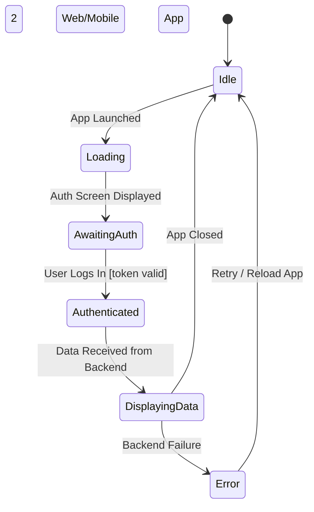
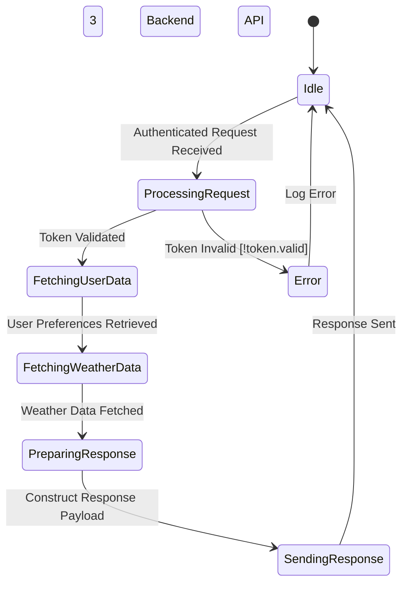
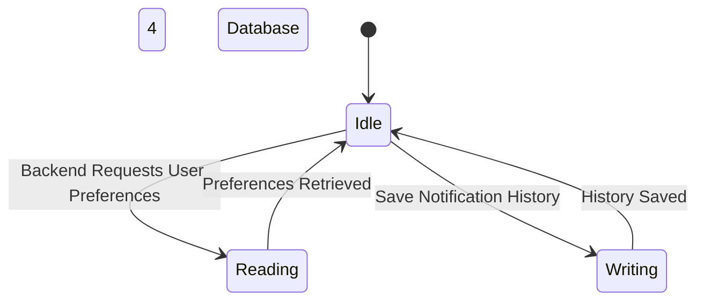
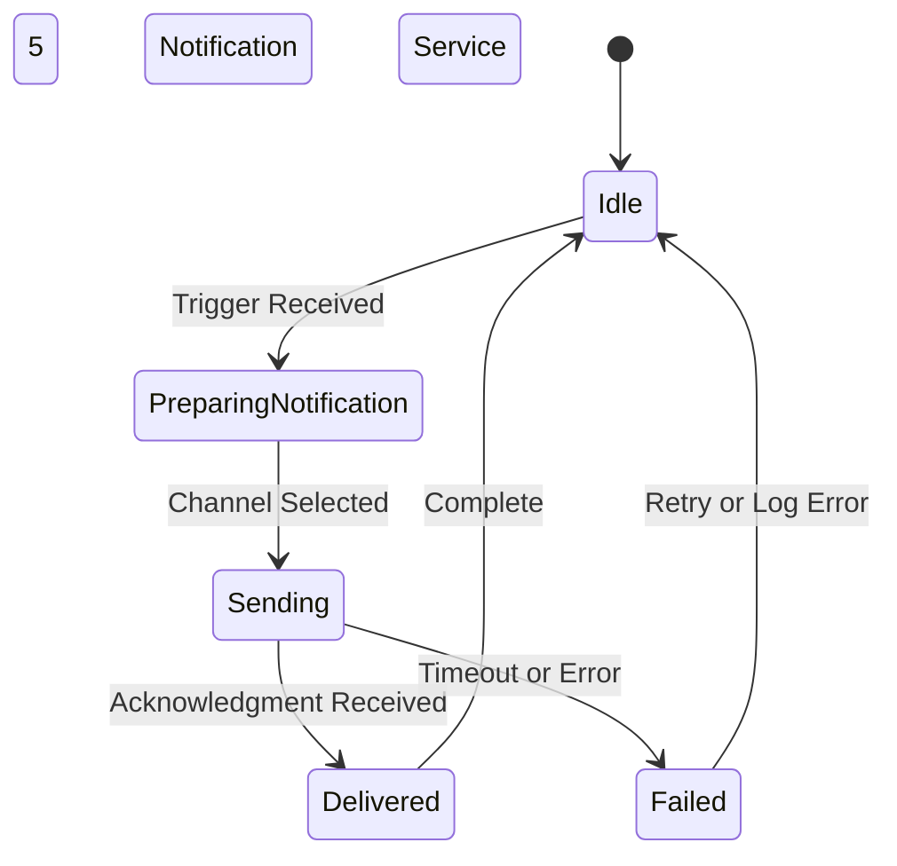
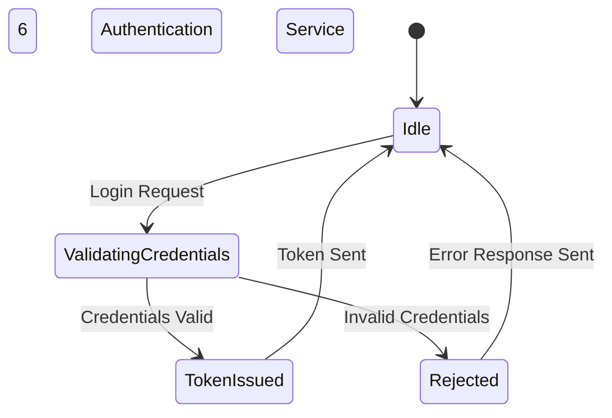
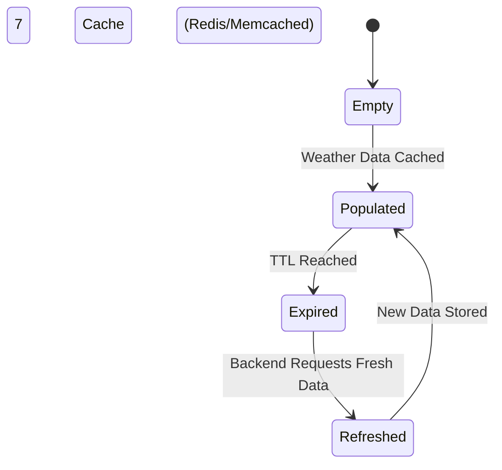

```mermaid
%% 1. User State Transition Diagram
stateDiagram-v2
    1 User State Transition
    [*] --> LoggedOut
    LoggedOut --> Authenticating : Enters Credentials
    Authenticating --> Authenticated : Token Received [token is valid]
    Authenticating --> LoggedOut : Token Rejected [invalid credentials]
    Authenticated --> ViewingData : App Loaded
    ViewingData --> LoggedOut : User Logs Out
```

```mermaid
%% 2. Web/Mobile App State Transition Diagram
stateDiagram-v2
    2 Web/Mobile App State Transition
    [*] --> Idle
    Idle --> Loading : App Launched
    Loading --> AwaitingAuth : Auth Screen Displayed
    AwaitingAuth --> Authenticated : User Logs In [token valid]
    Authenticated --> DisplayingData : Data Received from Backend
    DisplayingData --> Error : Backend Failure
    Error --> Idle : Retry / Reload App
    DisplayingData --> Idle : App Closed
```

```mermaid
%% 3. Backend API State Transition Diagram
stateDiagram-v2
    3 Backend API State Transition
    [*] --> Idle
    Idle --> ProcessingRequest : Authenticated Request Received
    ProcessingRequest --> FetchingUserData : Token Validated
    FetchingUserData --> FetchingWeatherData : User Preferences Retrieved
    FetchingWeatherData --> PreparingResponse : Weather Data Fetched
    PreparingResponse --> SendingResponse : Construct Response Payload
    SendingResponse --> Idle : Response Sent
    ProcessingRequest --> Error : Token Invalid [!token.valid]
    Error --> Idle : Log Error
```

```mermaid
%% 4. Database State Transition Diagram
stateDiagram-v2
    4 Database State Transition
    [*] --> Idle
    Idle --> Reading : Backend Requests User Preferences
    Idle --> Writing : Save Notification History
    Reading --> Idle : Preferences Retrieved
    Writing --> Idle : History Saved
```

```mermaid
%% 5. Notification Service State Transition Diagram
stateDiagram-v2
    5 Notification Service State Transition
    [*] --> Idle
    Idle --> PreparingNotification : Trigger Received
    PreparingNotification --> Sending : Channel Selected
    Sending --> Delivered : Acknowledgment Received
    Sending --> Failed : Timeout or Error
    Delivered --> Idle : Complete
    Failed --> Idle : Retry or Log Error
```

```mermaid
%% 6. Authentication Service State Transition Diagram
stateDiagram-v2
    6 Authentication Service State Transition
    [*] --> Idle
    Idle --> ValidatingCredentials : Login Request
    ValidatingCredentials --> TokenIssued : Credentials Valid
    ValidatingCredentials --> Rejected : Invalid Credentials
    TokenIssued --> Idle : Token Sent
    Rejected --> Idle : Error Response Sent
```

```mermaid
%% 7. Cache State Transition Diagram
stateDiagram-v2
    7 Cache (Redis/Memcached) State Transition
    [*] --> Empty
    Empty --> Populated : Weather Data Cached
    Populated --> Expired : TTL Reached
    Expired --> Refreshed : Backend Requests Fresh Data
    Refreshed --> Populated : New Data Stored
```
