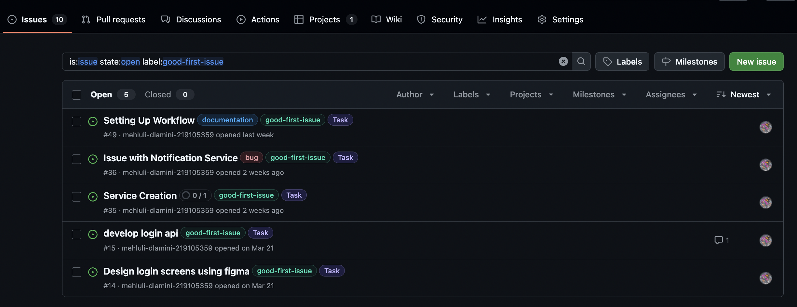
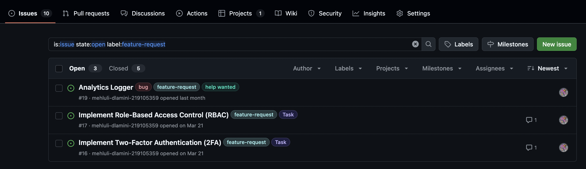

#  Contributing to Sundry Notification Web App

Hi , Thanks for helping make South African roads just a little safer. 🚗💨☁️ This document will guide you with issues you can contribute to AFTER setting up, writing quality code, and submitting your changes.

---

## Issues open for contribution



### Prerequisites

* Node.js 18+
* npm 9+
* Git

### Installation

1. **Clone the repo**

   ```bash
   git clone https://github.com/mehluli-dlamini-219105359/sundry-weather-notifications.git
   cd sundry-weather-notifications
   ```

2. **Install dependencies**

   ```bash
   npm ci
   ```

3. **Run the development server**

   ```bash
   npm run dev
   ```

4. **Run unit tests**

   ```bash
   npm run test:unit
   ```

---

## Coding Standards

### TypeScript

* Use strong typing wherever possible.
* Encapsulate logic in classes under `src/models`.
* Separate concerns (e.g., `factories`, `repositories`, `services`, etc.)

### Linting & Formatting

* **(Optional)** Add ESLint and Prettier in the future.
* Stick to clear, readable naming conventions.
* Prefer composition over inheritance unless it adds clarity.

### Testing

* Use **Jest** for all tests (`tests/unit`).
* Every new class or method should include a corresponding unit test.
* Run `npm run test:unit` before submitting a PR.

---

## Picking Issues

1. Visit [Issues](https://github.com/mehluli-dlamini-219105359/sundry-weather-notifications/issues).
2. Filter by `good-first-issue`, `bug`, or `enhancement` labels.
3. Comment on the issue to claim it.
4. Wait for approval/assignment before starting work.

---

## Pull Request Workflow

1. **Fork this repository**

2. **Create a branch**

   ```bash
   git checkout -b fix/wind-threshold-alert
   ```

3. **Make your changes**

   * Add unit tests for any new logic.

4. **Commit clearly**

   ```bash
   git commit -m "fix: improve wind alert notification logic"
   ```

5. **Push and create a PR**

   * PR title: use conventional commits (`feat:`, `fix:`, `chore:`, etc.)
   * Describe what you did and link to the relevant issue.
   * Tag reviewers if necessary.

---

## CI/CD & Deployment

* **CI runs on**: every push & pull request.
* **Tests run in**: GitHub Actions using Ubuntu and Node.js 18.
* **Artifacts** are built and uploaded from the `dist/` folder.
* **Production build triggers** only on `main` after a successful build.

---

## Additionally

Feel free to open a GitHub Discussion or contact Me [@mehluli-dlamini-219105359](https://github.com/mehluli-dlamini-219105359).

